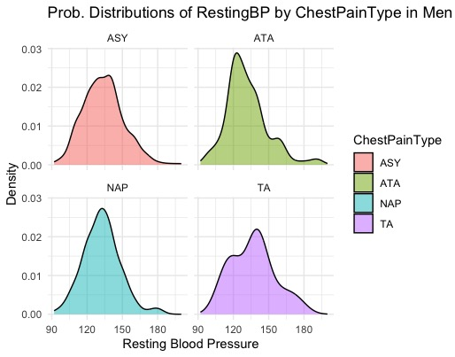
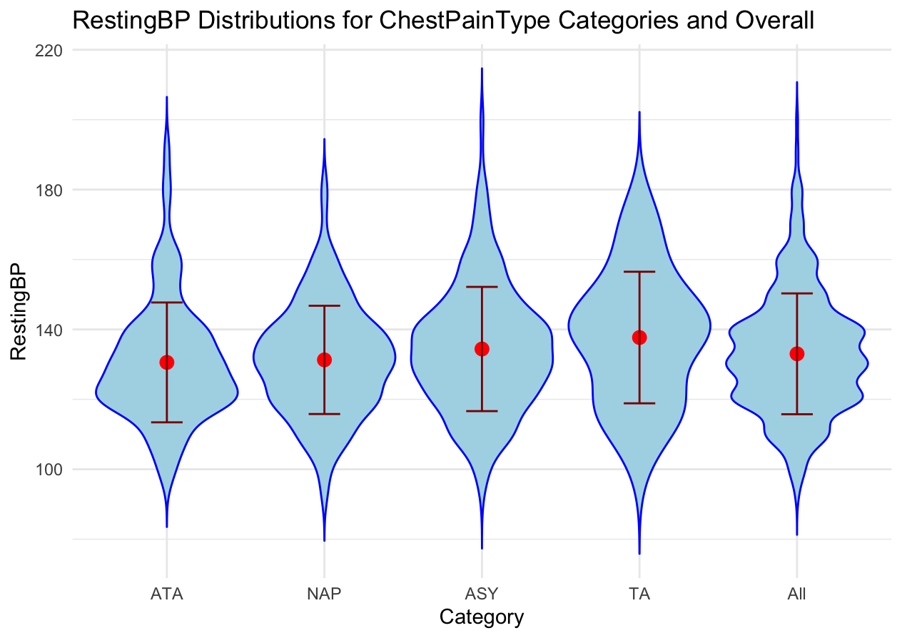
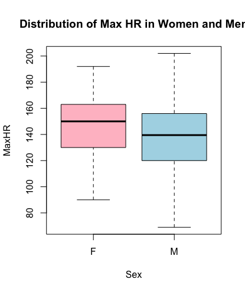
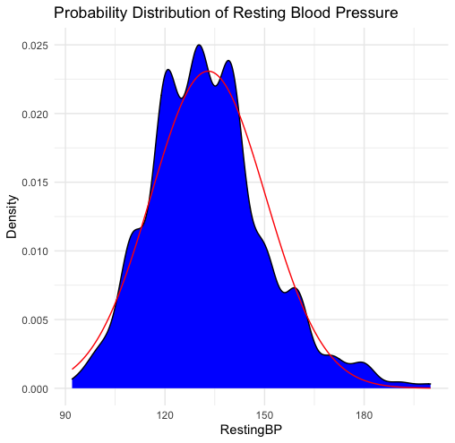
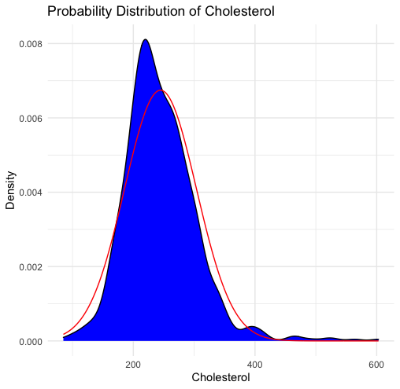

# R-Projekt 99

RProject
================
Kirill Khvastow, Inga Stakhurska, Stefan Shushpanov

## 1. Beschreibung

In unserem Projekt liegt der Fokus auf der Analyse eines Gesundheitsdatensatzes, 
der Informationen zu verschiedenen Gesundheitsaspekten bereithält. 

Der Datensatz wurde von einem Kaggle-Dataset-Experten erstellt. (https://www.kaggle.com/amirmahdiabbootalebi), 
umfasst 748 Messungen von Schlüsselvariablen, die für unsere Untersuchung von Interesse sind:

**Age** 

Maßeinheit: Jahre
 
**Sex** 

Maßeinheit: Kategorisch ("männlich" / "weiblich")
 
**ChestPainType** 

Maßeinheit: Kategorisch (ATA-typische Angina, NAP-nicht-anginalen Schmerz, 
                  ASY-atypische Angina, TA-nicht spezifizierten Brustschmerz)
 
**RestingBP** 

Maßeinheit: mmHg (Millimeter Quecksilbersäule)
 
**Cholesterol** 

Maßeinheit: mg/dL (Milligramm pro Deziliter)
 
**MaxHR**  

Maßeinheit: Schläge pro Minute (bpm)
 
**HeartDisease**  

Maßeinheit: Binär (0 für die Abwesenheit von Herzkrankheiten, 1 für das Vorhandensein von Herzkrankheiten)
 
    

Diese Daten wurden sorgfältig ausgewählt, um Einblicke in die allgemeine Gesundheit und mögliche 
Zusammenhänge zwischen verschiedenen Faktoren zu gewinnen. 

Nach kurzer Analyse des Datasets ergab sich die Forschungsfrage:  

**Gibt es einen signifikanten Unterschied zwischen Erwartungswerte von Ruheblutdruck je nach Brustschmerztyp?**
 

## 2. Explorative Analyse

Die folgende Tabelle gibt eine Übersicht über die numerischen Zusammenfassungen unseres Datensatzes.
 
|              | Minimum | Maximum |    Mean    |  Variance  |
| ------------ |---------|---------|------------|------------|
| Age          |   28    |   77    | 52.88204   |  90.36191  |  
| RestingBP    |   92    |   200   | 133.02279  |  298.69344 |
| Cholesterol  |   85    |   603   | 244.63539  |  3499.13936| 
| MaxHR        |   69    |   202   | 140.22654  |  601.43183 |

Um einen umfassenden Einblick zu erhalten, haben wir den ruhenden Blutdruck bei 
verschiedenen Arten von Brustschmerzen (ASY/ATA/NAP/TA) bei Männern genauer untersucht 
und haben folgende Abhängigkeit erhalten:  
        

Die Violin-Grafik zeigt, dass eine weitere statistische Analyse von Interesse wäre. 

Als nächstes haben wir die Verteilung der maximalen Herzfrequenz zwischen Geschlechtern, 
die Verteilung des Ruheblutdrucks und Cholesterols untersucht.

Die Ergebnisse, wie in den Abbildungen deutlich ersichtlich,

    
    

    
deuten darauf hin, dass beide Variablen einer Normalverteilung folgen. 

## 3. Statistische Methode

Im Rahmen unseres Projektes wollen wir identifizieren, ob es einen statistisch signifikanten Einfluss vom Brustschmerztyp auf den Ruheblutdruck gibt. Da uns 4 Kategorien von Brustschmerz vorliegen, werden wir eine Varianzanalyse durchführen.
Wir beginnen mit H0: Erwartungswerte des Ruheblutdrucks der vier Kategorien sind gleich.
Die Alternativhypothese H1 lautet: Es gibt zwei Gruppen, deren Erwartungswerte sich statistisch signifikant unterscheiden.

Um diese Hypothese zu überprüfen, benutzen wir ein F-Test. Bei einer Varianzanalyse benutzen wir den Quotient von mittleren Abweichungsquadraten durch die mittlere Residuenquadratsumme, dies erlaubt uns die Beziehung von der Varianz zwischen den Kategorien und der Varianz innerhalb der Kategorien zu analysieren. Da die Gruppen unterschiedlich viele Elemente enthalten, handelt es sich um eine nicht-orthogonale Varianzanalyse.

Das Modell ist von folgenden Annahmen abhängig:
1. Die Beobachtungen sind Unabhängig
2. Die Störterme sind N(0, sigma^2) verteilt.
3. Die Varianz der verschieden Gruppen soll gleich sein.

Aus der Grafiken der explorative Analyse lesen wir, dass die Kategorien annähernd normalverteilt sind und die Violin-Grafik zeigt, dass die Unterschiede in der Varianz auch klein sind. Daher kann die Varianzanalyse durchgeführt werden. 

Quellen: 

Statistik: Weg zur Datenanalyse https://link.springer.com/book/10.1007/978-3-662-50372-0 (Seiten 477-486)

Multivariate Statistik https://link.springer.com/book/10.1007/978-3-322-84476-7?error=cookies_not_supported&code=12bc50dd-ef9a-4527-b2b0-b1c2d45bb01f (Seiten 139-149)

Falls die Varianzanalyse statistische Signifikanz ergibt, werden wir auch ein Tukey post-hoc Test durchführen, um zu untersuchen, welche Gruppen genau sich signifikant unterscheiden. Der Test hat die gleichen Annahmen wie die Varianzanalyse und ist eine konservativere Variante des T-Tests.

Quellen:
https://statistikguru.de/spss/einfaktorielle-anova/tukey-post-hoc-test.html
https://schmidtpaul.github.io/crashcouRse/appendix_posthoc.html

## 4. Ergebnisse und Analyse 

Die Analyse des Zusammenhangs zwischen Brustschmerztyp und Ruheblutdruck (RestingBP) ergab statistisch signifikante Unterschiede zwischen einigen Kategorien. Die Ergebnisse des Tukey-HSD-Tests zeigen jedoch, dass nicht alle Unterschiede zwischen den Gruppen statistisch signifikant sind. Dies bedeutet, dass weitere Forschungen erforderlich sind, um ein tieferes Verständnis der Beziehung zwischen diesen Variablen zu erlangen.

|               | Df  | Sum Sq | Mean Sq | F value | Pr(>F)   |
|---------------|-----|--------|---------|---------|----------|
| ChestPainType | 3   | 3101   | 1033.8  | 3.496   | 0.0153 * |
| Residuals     | 742 | 219425 | 295.7   |         |          |

Significance Codes:
 0 ‘\*\*\*’ 0.001 ‘\*\*’ 0.01 ‘\*’ 0.05 ‘.’ 0.1 ‘ ’ 1

Die Analyse der statistischen Daten zeigt Unterschiede in den Durchschnittswerten des Ruheblutdrucks (RestingBP) zwischen den Kategorien von Brustschmerzen, aber diese Unterschiede sind nicht gleichmäßig über alle Kategorien verteilt.

Tukey Multiple Comparisons of Means

| Comparison | Difference | Lower Bound | Upper Bound | Adjusted p |
|------------|------------|-------------|-------------|------------|
| ATA-ASY    | -3.833735  | -7.970138   | 0.302668    | 0.0805519  |
| NAP-ASY    | -3.110059  | -7.221041   | 1.000922    | 0.2090459  |
| TA-ASY     | 3.282927   | -4.005327   | 10.57118    | 0.6524202  |
| NAP-ATA    | 0.723676   | -4.114931   | 5.562283    | 0.9805744  |
| TA-ATA     | 7.116662   | -0.605423   | 14.83875    | 0.0832181  |
| TA-NAP     | 6.392986   | -1.315511   | 14.10148    | 0.1428788  |

Trotz signifikanter Unterschiede in den Durchschnittswerten zwischen verschiedenen Kategorien weisen hohe p-Werte auf das Fehlen statistischer Signifikanz dieser Unterschiede hin. Dies ist besonders im folgenden Fall erkennbar:
TA-ATA: Der Unterschied im Durchschnitt beträgt 7.11, aber der p-Wert von 0.0832181 liegt über der Schwelle der statistischen Signifikanz, was darauf hindeutet, dass der beobachtete Unterschied zufällig sein könnte.

Zusammenfassend lässt sich aus der Datenanalyse ableiten, dass trotz einiger Unterschiede in den Durchschnittswerten zwischen den Kategorien das Fehlen statistischer Signifikanz in den meisten Fällen die Notwendigkeit weiterer umfassender Forschungen unterstreicht, um die Zusammenhänge zwischen Brustschmerztyp und Ruheblutdruck vollständig zu verstehen.

